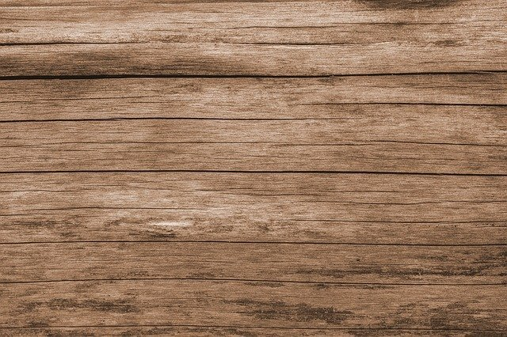
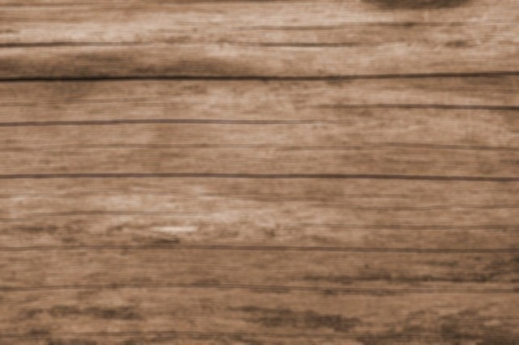

# OpenCV Training Image Filtering Convolution

An introduction to Convolution Kernels using OpenCV.

## Contents :
I have used 2D-convolution kernels and the OpenCV Computer Vision library to apply different blurring and sharpening techniques to an image. 
These are the functions that I have used:

| Function        |Action                                                                        |
|----------------:|------------------------------------------------------------------------------|
|cv2.imread()     |We read the image        |
|cv2.filter2D()   |We apply the filter, that accepts 3 arguments:|
|**src**          | Source image|
|**ddepth**       | The second argument is ddepth, which indicates the depth of the resulting image|
|**kernel**       |The identity kernel is a square matrix, where the middle element is 1, and all other elements are zero.|

## Test Image used: 
I have used test.jpg & identity.jpg that can be found in the repository.




## Summary:

```python
#Read image
image = cv2.imread('test.jpg')
```
```python
#Define kernel
kernel1 = np.array([[0, 0, 0],
                   [0, 1, 0],
                   [0, 0, 0]])
```
```python
#Define arguments for filter2D()
identity = cv2.filter2D(src=image, ddepth=-1, kernel=kernel1)
```


